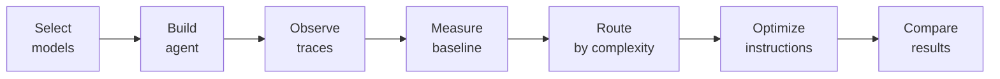
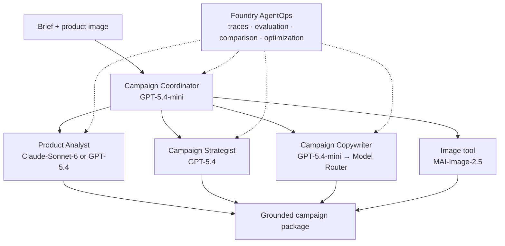

<p align="center">
  
</p>

# From Model Selection to Agent Optimization with Microsoft Foundry

**Let’s build, measure, and improve a product-launch agent together in 90 minutes.**

| **Audience** | **Format** | **Outcome** |
|---|---|---|
| Developers familiar with models and agents, but new to Foundry | 3 labs · 10 modules · 90 minutes | An agent we can run, inspect, score, and improve |

> [Start the self-guided workshop](./instructions/self-guided/README.md) ·
> [Open Lab 0: Setup](./instructions/self-guided/lab-0-setup/README.md) ·
> [View the Skillable track](./instructions/skillable/README.md)

---

## Your journey



We’ll change **one thing at a time**, then score each version with the
**same test cases and judging criteria**. That way, we know what helped.

| How we’ll climb | Where we’ll do it |
|---|---|
| Measure where we are | [Module 07: Baseline evaluation](./instructions/self-guided/lab-2-agent-optimize/07-baseline-evaluation.md) |
| Change one thing | [Module 08: Model Router](./instructions/self-guided/lab-2-agent-optimize/08-model-router-swap.md) |
| Measure again before keeping the change | [Module 09: Agent Optimizer](./instructions/self-guided/lab-2-agent-optimize/09-agent-optimizer.md) |

---

## The scenario

| Product | Mission |
|---|---|
|  | We’re launching the **HikeMate TrailLite Daypack**. Our marketing team wants persuasive copy, but every product claim must come from the supplied image or brief. If the brief says “water-resistant,” our agent must not turn that into “waterproof.” |

[Review the campaign brief](./src/data/campaign-brief.md) ·
[Inspect image provenance](./src/assets/PROVENANCE.md) ·
[Open the evaluation rubric](./src/data/evaluators/campaign-quality.yaml)

### Agent architecture



We’ll focus our improvements on the **Campaign Copywriter**. First, we’ll change
how it picks a model in
[Module 08](./instructions/self-guided/lab-2-agent-optimize/08-model-router-swap.md).
Then, we’ll improve its instructions in
[Module 09](./instructions/self-guided/lab-2-agent-optimize/09-agent-optimizer.md).

---

## Labs at a glance

| Lab | What you do | Time |
|---|---|---:|
| [Lab 0: Setup](./instructions/self-guided/lab-0-setup/README.md) | Get Foundry ready and learn how we’ll measure progress | 15 min |
| [Lab 1: Explore models](./instructions/self-guided/lab-1-model-explore/README.md) | Compare models, run our agent, and see what happens behind the scenes | 48 min |
| [Lab 2: Optimize the agent](./instructions/self-guided/lab-2-agent-optimize/README.md) | Score our starting point, try Model Router, and improve the copywriter | 27 min |
| **Total** | | **90 min** |

<details>
<summary><strong>View all 10 modules</strong></summary>

| # | Module | Time |
|---:|---|---:|
| 01 | [Provision the workshop environment](./instructions/self-guided/lab-0-setup/01-provision-environment.md) | 10 min |
| 02 | [Orient to the studio and the hill](./instructions/self-guided/lab-0-setup/02-orientation.md) | 5 min |
| 03 | [Explore models in the playground](./instructions/self-guided/lab-1-model-explore/03-model-playground.md) | 18 min |
| 04 | [Run the agent locally](./instructions/self-guided/lab-1-model-explore/04-run-agent-locally.md) | 12 min |
| 05 | [Deploy and version the agent](./instructions/self-guided/lab-1-model-explore/05-deploy-and-version.md) | 10 min |
| 06 | [Observe traces and metrics](./instructions/self-guided/lab-1-model-explore/06-observe-the-agent.md) | 8 min |
| 07 | [Establish a baseline](./instructions/self-guided/lab-2-agent-optimize/07-baseline-evaluation.md) | 12 min |
| 08 | [Switch to Model Router](./instructions/self-guided/lab-2-agent-optimize/08-model-router-swap.md) | 5 min |
| 09 | [Optimize copywriter instructions](./instructions/self-guided/lab-2-agent-optimize/09-agent-optimizer.md) | 5 min |
| 10 | [Compare results and wrap up](./instructions/self-guided/lab-2-agent-optimize/10-wrap-up.md) | 5 min |

</details>

---

## Let’s get ready

- Azure subscription with permission and quota for the
  [required models](./sample.env).
- GitHub Codespaces or a Linux Dev Container with Bash.
- Python 3.11+, [Azure CLI](https://learn.microsoft.com/cli/azure/install-azure-cli),
  and [Azure Developer CLI](https://learn.microsoft.com/azure/developer/azure-developer-cli/install-azd).

Set these two shortcuts so every command knows where the workshop lives:

```bash
export WORKSHOP_ROOT=/workspaces/model-mastery/foundry/agent-optimization
export WORKSHOP_SRC="$WORKSHOP_ROOT/src"
```

We’re ready. Let’s begin with
[Module 01: Provision the workshop environment](./instructions/self-guided/lab-0-setup/01-provision-environment.md).

---

<details>
<summary><strong>Repository map</strong></summary>

```text
foundry/agent-optimization/
├── README.md
├── sample.env
├── requirements.txt
├── instructions/
│   ├── self-guided/
│   └── skillable/
└── src/
    ├── azure.yaml
    ├── agents/product-launch-studio/
    ├── assets/
    ├── checkpoints/
    ├── data/
    ├── docs/
    ├── infra/
    └── scripts/
```

</details>

<details>
<summary><strong>Instructor preparation</strong></summary>

1. Verify exact model identifiers, versions, regional availability, Marketplace
   terms, and quota listed in [`sample.env`](./sample.env).
2. Run [`src/scripts/preflight.sh`](./src/scripts/preflight.sh) and the complete
   workshop before delivery.
3. Refresh the prepared comparison artifacts used by
   [Module 07](./instructions/self-guided/lab-2-agent-optimize/07-baseline-evaluation.md),
   [Module 08](./instructions/self-guided/lab-2-agent-optimize/08-model-router-swap.md),
   and [Module 09](./instructions/self-guided/lab-2-agent-optimize/09-agent-optimizer.md).
4. Tell learners which region and model versions to use, and identify preview
   features. Routing outcomes are measured, never promised.

[Open the full instructor guide](./src/docs/instructor-guide.md).

</details>

---

## How we’ll work

| We will | We won’t |
|---|---|
| Compare every version with the same tests | Treat our small test set as a universal benchmark |
| Look at quality, speed, and usage together | Promise which model will answer a specific request |
| Read suggested instruction changes before applying them | Let Agent Optimizer change or deploy our agent automatically |
| Link to current Microsoft guidance | Depend on portal screenshots that may quickly become outdated |

## References

[Microsoft Foundry](https://learn.microsoft.com/azure/ai-foundry/what-is-azure-ai-foundry) ·
[Hosted agents](https://learn.microsoft.com/azure/ai-foundry/agents/concepts/hosted-agents) ·
[Model Router](https://learn.microsoft.com/azure/ai-foundry/openai/concepts/model-router) ·
[Evaluation](https://learn.microsoft.com/azure/ai-foundry/concepts/evaluation-approach-gen-ai) ·
[Observability](https://learn.microsoft.com/azure/ai-foundry/concepts/observability) ·
[Azure Developer CLI](https://learn.microsoft.com/azure/developer/azure-developer-cli/reference)

Part of [Model Mastery](../../README.md) · [Browse Foundry workshops](../README.md)
