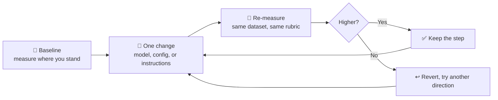

# From Model Selection To Agent Optimization with Microsoft Foundry

A **90-minute, self-guided workshop** that takes you from *"which model should I use?"* to *"prove this change made the agent better."*

You will build one realistic agent — **Product Launch Studio** — and then improve it three different ways: by **choosing** models, by **reconfiguring** a model deployment, and by **optimizing** an agent's instructions. Every change is measured against the **same dataset and the same rubric**, so improvement is a fact, not an opinion.

> **Audience.** You already understand models and agents. You may be brand new to Microsoft Foundry. You are comfortable with Bash and a terminal.

<br/>

## 1. The one idea: hill climbing

Imagine your agent standing on a foggy hillside. You cannot see the summit. You can only measure your **current altitude** and take a **step**.



Three rules make hill climbing work, and this workshop enforces all three:

| Rule | Why it matters | Where you practice it |
|---|---|---|
| **Measure before you move** | Without a baseline, "better" is a feeling. | Module `07` |
| **Change one thing at a time** | Two simultaneous changes give one ambiguous result. | Modules `08`, `09` |
| **Never move the mountain** | A new dataset or rubric invalidates every prior score. | Modules `07`–`09` |

The three steps you take are deliberately different **kinds** of steps:

| Step | What changes | What does **not** change | Module |
|---|---|---|---|
| **Model choice** | Which model each role uses | Nothing else | `03` |
| **Deployment config** | The model behind the `adaptive-copy` deployment becomes **Model Router** | Agent code, deployment name, dataset, rubric | `08` |
| **Instructions** | Agent Optimizer proposes better copywriter instructions | Model, dataset, rubric | `09` |

<br/>

## 2. The scenario: Product Launch Studio

Contoso is launching the **TrailPack**, a synthetic 22 L day-hiking backpack. Marketing needs launch copy fast, and legal needs it to be *defensible*. The agent's hard constraint: **every measurable claim must carry an evidence ID (E1–E5) and keep its qualifier.** No waterproofing, no carbon neutrality, no invented certification, no "most durable on the market."

The agent runs **four roles plus one image tool**, in order:

| # | Role | Job | Model deployment | Backing model |
|---|---|---|---|---|
| 1 | **Campaign coordinator** | Turns the request into a launch brief and assembles the kit | `campaign-coordinator` | GPT-5.4-mini |
| 2 | **Product analyst** | Extracts only facts supported by the evidence ledger, including the product imagery | `visual-understanding` | Claude-Sonnet-6 (fallback: GPT-5.4) |
| 3 | **Campaign strategist** | Chooses audience, channel, and message plan | `campaign-reasoning` | GPT-5.4 |
| 4 | **Campaign copywriter** ⭐ | Writes evidence-cited headlines, body copy, and channel variants | `adaptive-copy` | GPT-5.4-mini → **Model Router** |
| 🛠️ | **MAI image tool** | Generates hero visuals — a tool the copywriter calls, not a fifth role | `creative-image` | MAI-Image-2.5 |

⭐ The copywriter is your **optimization target**. It is the only component you change in Lab 2 — first its model (via deployment config), then its instructions (via Agent Optimizer).

**Grounded evidence** lives in [`src/data/campaign-brief.md`](./src/data/campaign-brief.md) and [`src/assets/`](./src/assets/). The orchestration hands the original, immutable evidence ledger to every role rather than trusting a role to copy it forward.

**Unsupported-claim prevention** works at two levels: a deterministic **claim guard** checks every copy item before release, and the evaluation rubric in [`src/data/evaluators/campaign-quality.yaml`](./src/data/evaluators/campaign-quality.yaml) caps the score at 2 for any fabricated fact or unsupported comparative, durability, health, environmental, or waterproof claim.

<br/>

## 3. Start here

| | |
|---|---|
| 🚀 **Self-guided path** | **[instructions/self-guided/README.md](./instructions/self-guided/README.md)** — start with Lab 0, Module 01 |
| ⏱️ **Total time** | 90 minutes, in 10 modules across 3 labs |
| 💻 **Environment** | GitHub Codespaces or a Linux Dev Container (Bash). Local Linux/macOS works too. |

### The three labs

| Lab | Folder | Focus | Time |
|---|---|---|---|
| **Lab 0 — Setup** | [`lab-0-setup`](./instructions/self-guided/lab-0-setup/README.md) | Provision the environment, learn the scenario and the hill-climbing frame | 15 min |
| **Lab 1 — Explore models** | [`lab-1-model-explore`](./instructions/self-guided/lab-1-model-explore/README.md) | Compare models in the playground, run the agent locally, deploy it, watch it work | 48 min |
| **Lab 2 — Optimize the agent** | [`lab-2-agent-optimize`](./instructions/self-guided/lab-2-agent-optimize/README.md) | Baseline evaluation, Model Router swap, Agent Optimizer, decision | 27 min |

### Full timing map

| # | Module | Lab | Time |
|---|---|---|---|
| 01 | [Provision the workshop environment](./instructions/self-guided/lab-0-setup/01-provision-environment.md) | 0 | 10 min |
| 02 | [Orientation: the studio and the hill](./instructions/self-guided/lab-0-setup/02-orientation.md) | 0 | 5 min |
| 03 | [Model playground: pick the right tool](./instructions/self-guided/lab-1-model-explore/03-model-playground.md) | 1 | 18 min |
| 04 | [Run the agent locally](./instructions/self-guided/lab-1-model-explore/04-run-agent-locally.md) | 1 | 12 min |
| 05 | [Deploy and version the agent](./instructions/self-guided/lab-1-model-explore/05-deploy-and-version.md) | 1 | 10 min |
| 06 | [Observe what the agent actually did](./instructions/self-guided/lab-1-model-explore/06-observe-the-agent.md) | 1 | 8 min |
| 07 | [Baseline evaluation](./instructions/self-guided/lab-2-agent-optimize/07-baseline-evaluation.md) | 2 | 12 min |
| 08 | [Swap in Model Router](./instructions/self-guided/lab-2-agent-optimize/08-model-router-swap.md) | 2 | 5 min |
| 09 | [Agent Optimizer](./instructions/self-guided/lab-2-agent-optimize/09-agent-optimizer.md) | 2 | 5 min |
| 10 | [Wrap-up and next steps](./instructions/self-guided/lab-2-agent-optimize/10-wrap-up.md) | 2 | 5 min |
| | **Total** | | **90 min** |

<br/>

## 4. Repository map

Every command in this workshop uses a single anchor, `WORKSHOP_ROOT`, which points at **this folder**:

```bash
export WORKSHOP_ROOT=/workspaces/model-mastery/foundry/agent-optimization
export WORKSHOP_SRC="$WORKSHOP_ROOT/src"
```

```text
foundry/agent-optimization/            # $WORKSHOP_ROOT
├── README.md                          # you are here
├── sample.env                         # every variable the workshop reads (copy to .env)
├── requirements.txt                   # Python dependencies
├── instructions/                      # self-guided and Skillable curricula
│   ├── self-guided/                   # 10 modules across three labs
│   └── skillable/                     # Windows lab delivery track
└── src/                               # $WORKSHOP_SRC — azd project root
    ├── azure.yaml                     # model deployments + hosted agent service definition
    ├── infra/                         # Bicep: Foundry account, project, App Insights, deployments
    ├── scripts/                       # preflight, configure, provision, router, cleanup
    ├── data/                          # campaign brief, eval cases, evaluator rubric, eval.yaml
    ├── assets/                        # product imagery used for grounding and vision prompts
    ├── agents/product-launch-studio/  # hosted agent source, configuration, and tests
    ├── checkpoints/                   # offline baseline and candidate artifacts
    └── docs/                          # workshop, instructor, and operational guides
```

<br/>

## 5. Prerequisites

- An **Azure subscription** where you can create a Foundry account, project, and model deployments (Owner or Contributor + User Access Administrator).
- **Quota** in one region for all five deployments listed in section 2.
- **GitHub Codespaces** or a Linux Dev Container. If you work locally, you need Bash, Python 3.11+, the [Azure CLI](https://learn.microsoft.com/cli/azure/install-azure-cli), and the [Azure Developer CLI](https://learn.microsoft.com/azure/developer/azure-developer-cli/install-azd) (`azd` ≥ 1.20.0) with the `azure.ai.agents` extension.
- Willingness to **delete resources afterwards** — see Module 10.

<br/>

## 6. Instructor preparation

Self-guided learners provision their own environment. The **instructor owns everything that changes outside the repository**: model identifiers, versions, regional availability, quota, and reference results.

### T-7 days — verify the model layer

1. Confirm the exact catalog identifier, **version string**, format, and SKU for every model in `sample.env`:
   `gpt-5.4-mini`, `claude-sonnet-6` (and the `gpt-5.4` vision fallback), `gpt-5.4`, `MAI-Image-2.5`, and `model-router`.
   ```bash
   cd "$WORKSHOP_ROOT"
   az cognitiveservices model list --location <region> --output table
   ```
2. Fill the empty `*_MODEL_VERSION` values in your delivery copy of `.env`. `src/scripts/preflight.sh` **fails** while they are blank — that is intentional.
3. Verify **regional availability** for all five deployments in one region. Model Router and partner models are not available everywhere, and availability changes without notice.
4. Verify **quota** covers every `capacity` value in `src/azure.yaml`, and that Marketplace terms for partner models are accepted for the subscription.
5. Run the full 90 minutes end to end yourself. Nothing else substitutes for this.

### T-1 day — refresh the reference results

Modules 07–09 show **reference result tables** so learners can interpret their own output and so Lab 2 still lands if a job overruns. Replace those numbers with results from your own T-7 run, and note the date and model versions you used. Reference results are teaching aids, never a promise of outcome.

### Day of delivery — announce these four things

1. The **region** and **subscription** learners should use.
2. The **model versions** you verified (learners paste them into `.env`).
3. That **Model Router, Agent Optimizer, and the `azd ai agent` command surface are in preview** — flags and behaviour can change; see [Preview supplemental terms](https://azure.microsoft.com/support/legal/preview-supplemental-terms/).
4. That **routing is a hypothesis, not a guarantee.** Model Router may or may not lower cost or latency for this workload. The point of Lab 2 is that you can *tell*.

### Cut-lines if you fall behind

| Behind by | Cut | Keep |
|---|---|---|
| 5 min | Module 03 optional prompts (do 2 of 4) | The comparison table |
| 10 min | Module 06 deep trace drill-down | The first trace view |
| 15 min | Module 08 `--apply`; use `--preview` plus the reference table | Module 07 and Module 09 |

<br/>

## 7. What this workshop does not promise

- **No routing promises.** Model Router selects a model per request. We measure the effect; we never assert it will be cheaper, faster, or better.
- **No portal click-paths.** The Foundry portal evolves continuously. Instructions name *what to look for* ([ai.azure.com](https://ai.azure.com)) rather than fragile menu paths, and there are no screenshots to go stale.
- **No benchmark claims.** The evaluation set is small and scenario-specific. It is a decision aid for this scenario, not a benchmark.
- **No unattended changes.** Agent Optimizer candidates are **never** applied automatically. You read the diff, then you decide.

<br/>

## 8. References

- [What is Microsoft Foundry?](https://learn.microsoft.com/azure/ai-foundry/what-is-azure-ai-foundry)
- [Model catalog overview](https://learn.microsoft.com/azure/ai-foundry/how-to/model-catalog-overview) · [Foundry Models](https://learn.microsoft.com/azure/ai-foundry/foundry-models/concepts/models)
- [Hosted agents](https://learn.microsoft.com/azure/ai-foundry/agents/concepts/hosted-agents) · [Agents overview](https://learn.microsoft.com/azure/ai-foundry/agents/overview)
- [Model Router concepts](https://learn.microsoft.com/azure/ai-foundry/openai/concepts/model-router) · [Use Model Router](https://learn.microsoft.com/azure/ai-foundry/openai/how-to/model-router)
- [Evaluation approach for generative AI](https://learn.microsoft.com/azure/ai-foundry/concepts/evaluation-approach-gen-ai) · [Agent evaluators](https://learn.microsoft.com/azure/ai-foundry/concepts/evaluation-evaluators/agent-evaluators)
- [Observability in Foundry](https://learn.microsoft.com/azure/ai-foundry/concepts/observability) · [Trace agents](https://learn.microsoft.com/azure/ai-foundry/how-to/develop/trace-agents-sdk)
- [Azure Developer CLI reference](https://learn.microsoft.com/azure/developer/azure-developer-cli/reference) · [Quotas and limits](https://learn.microsoft.com/azure/ai-foundry/openai/quotas-limits)

Part of the [Model Mastery](../../README.md) series · see also [`foundry/`](../README.md).
