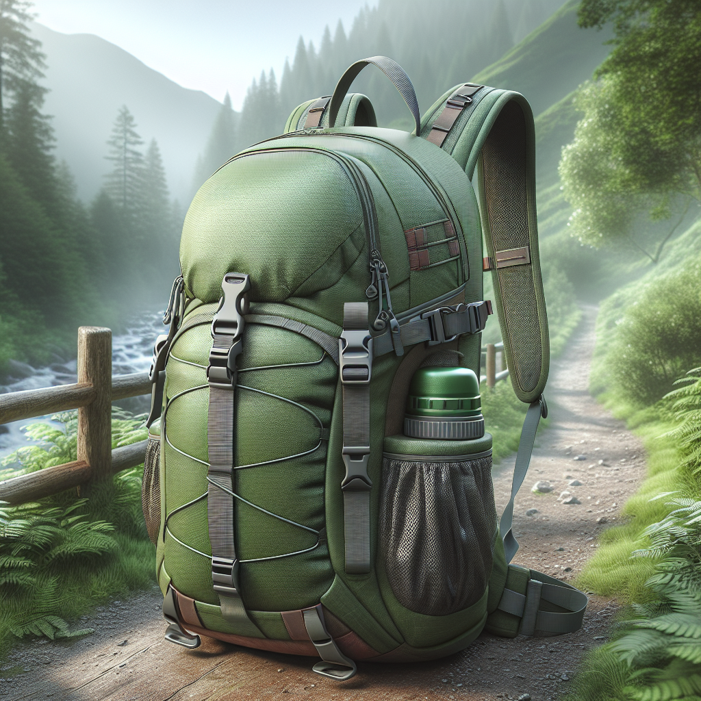
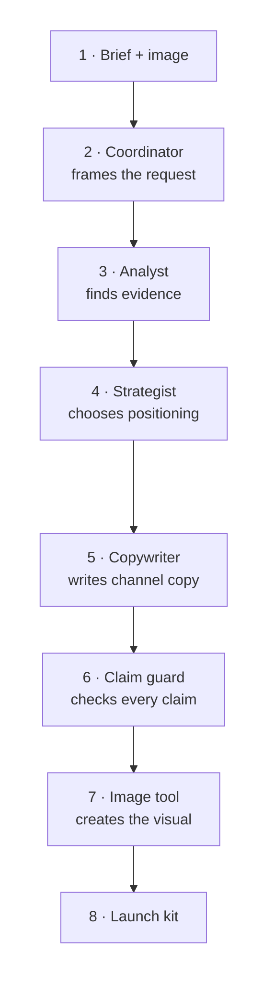
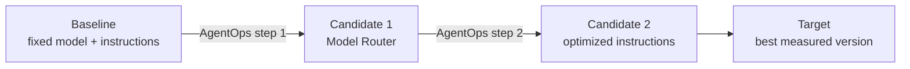
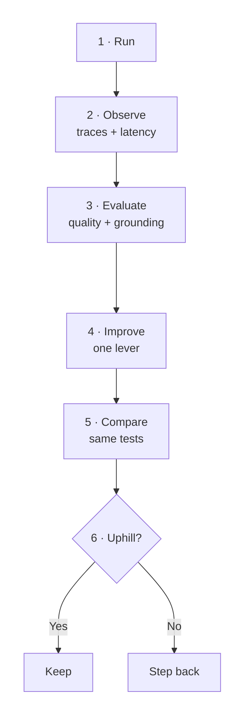

<p align="center">
  
</p>

# From Model Selection to Agent Optimization with Microsoft Foundry

**Let’s build, measure, and improve a product-launch agent together in 90 minutes.**

## 1. Who are you?

This workshop is for **developers and AI practitioners** who understand the
basics of models and agents but may be new to Microsoft Foundry.

You do not need prior Foundry experience. We’ll build the vocabulary as we use
it, and every module ends with a result you can check.

---

## 2. What is the objective?

We’ll turn a product brief and image into a grounded launch kit, then improve
the part of the agent that writes the campaign copy.

| Product | Mission |
|---|---|
|  | We’re launching the **HikeMate TrailLite Daypack**. Our marketing team wants persuasive copy, but every product claim must come from the supplied image or brief. If the brief says “water-resistant,” our agent must not turn that into “waterproof.” |

[Review the campaign brief](./src/data/campaign-brief.md) ·
[Inspect image provenance](./src/assets/PROVENANCE.md) ·
[Open the evaluation rubric](./src/data/evaluators/campaign-quality.yaml)

### Agent architecture: how one request becomes a launch kit

Think of the studio as a relay team. Each specialist adds one piece, then passes
the same evidence forward. Follow steps 1–4 across the top, then 5–8 back across
the bottom.



### Our optimization target

| Keep fixed | Improve | Success means |
|---|---|---|
| Product evidence, agent roles, test cases, and evaluation rubric | **Campaign Copywriter** model selection and instructions | Better grounded copy, with latency and usage visible alongside quality |

We’ll first change how the copywriter picks a model in
[Module 08: Model Router](./instructions/self-guided/lab-2-agent-optimize/08-model-router-swap.md).
Then we’ll improve its instructions in
[Module 09: Agent Optimizer](./instructions/self-guided/lab-2-agent-optimize/09-agent-optimizer.md).

---

## 3. What is our approach?

Two ideas work together at different scales:

- **Hill climbing is the entire journey** from our measured baseline toward our
  target. We move by changing one lever at a time.
- **AgentOps is the workflow for each step**. We run, observe, evaluate, improve,
  and compare before deciding whether that step moved us uphill.

Why does this matter? Changing the model, prompt, data, and scoring rules at the
same time may produce a different result, but we won’t know what caused it.
Hill climbing keeps the experiment small enough to explain and repeat.

### The complete hill climb



### The AgentOps workflow for each step



Foundry gives us the traces, evaluations, and versions that make each decision
visible instead of relying on a feeling that the agent seems better.

| Our step | Where we take it |
|---|---|
| Record our starting altitude | [Module 07: Baseline evaluation](./instructions/self-guided/lab-2-agent-optimize/07-baseline-evaluation.md) |
| Try adaptive model selection | [Module 08: Model Router](./instructions/self-guided/lab-2-agent-optimize/08-model-router-swap.md) |
| Try clearer copywriter instructions | [Module 09: Agent Optimizer](./instructions/self-guided/lab-2-agent-optimize/09-agent-optimizer.md) |
| Compare before deciding | [Module 10: Wrap-up](./instructions/self-guided/lab-2-agent-optimize/10-wrap-up.md) |

---

## 4. Prerequisites

| Track | What you need |
|---|---|
| **Self-guided** | An Azure subscription with permission and quota for the [required models](./sample.env); GitHub Codespaces or a Linux Dev Container; Python 3.11+; [Azure CLI](https://learn.microsoft.com/cli/azure/install-azure-cli); and [Azure Developer CLI](https://learn.microsoft.com/azure/developer/azure-developer-cli/install-azd) |
| **Skillable** | A workshop lab seat and access to the supplied Windows 11 VM. Azure resources, tools, and model deployments are already prepared. |

Model Router, Agent Optimizer, and the `azd ai agent` commands are preview
features. Their screens and command output may change.

---

## 5. Getting started

Choose the track that matches your environment:

| Track | Environment | Start here |
|---|---|---|
| **Self-guided** | Linux in GitHub Codespaces or a Dev Container; you provision the Foundry resources | [Open the self-guided workshop](./instructions/self-guided/README.md) |
| **Skillable** | Pre-provisioned Windows 11 lab with PowerShell | [Open the Skillable workshop](./instructions/skillable/README.md) |

Self-guided learners begin with
[Module 01: Provision the workshop environment](./instructions/self-guided/lab-0-setup/01-provision-environment.md).
Skillable learners begin with
[Welcome](./instructions/skillable/lab-0-setup/00-welcome.md).

---

## 6. Lab outline

Both tracks tell the same story in 90 minutes. Skillable spends less time on
setup because its Azure environment is already provisioned.

| Lab | What we do | Self-guided | Skillable |
|---|---|---:|---:|
| [Lab 0: Setup](./instructions/self-guided/lab-0-setup/README.md) | Get Foundry ready and meet the studio | 15 min | 10 min |
| [Lab 1: Explore models](./instructions/self-guided/lab-1-model-explore/README.md) | Match model capabilities to each job | 48 min | 23 min |
| [Lab 2: Optimize the agent](./instructions/self-guided/lab-2-agent-optimize/README.md) | Run, observe, score, and improve the agent | 27 min | 57 min |
| **Total** | | **90 min** | **90 min** |

<details>
<summary><strong>View the 10 self-guided modules</strong></summary>

| # | Module | Time |
|---:|---|---:|
| 01 | [Provision the workshop environment](./instructions/self-guided/lab-0-setup/01-provision-environment.md) | 10 min |
| 02 | [Orient to the studio and the hill](./instructions/self-guided/lab-0-setup/02-orientation.md) | 5 min |
| 03 | [Explore models in the playground](./instructions/self-guided/lab-1-model-explore/03-model-playground.md) | 18 min |
| 04 | [Run the agent locally](./instructions/self-guided/lab-1-model-explore/04-run-agent-locally.md) | 12 min |
| 05 | [Deploy and version the agent](./instructions/self-guided/lab-1-model-explore/05-deploy-and-version.md) | 10 min |
| 06 | [Observe traces and metrics](./instructions/self-guided/lab-1-model-explore/06-observe-the-agent.md) | 8 min |
| 07 | [Establish a baseline](./instructions/self-guided/lab-2-agent-optimize/07-baseline-evaluation.md) | 12 min |
| 08 | [Switch to Model Router](./instructions/self-guided/lab-2-agent-optimize/08-model-router-swap.md) | 5 min |
| 09 | [Optimize copywriter instructions](./instructions/self-guided/lab-2-agent-optimize/09-agent-optimizer.md) | 5 min |
| 10 | [Compare results and wrap up](./instructions/self-guided/lab-2-agent-optimize/10-wrap-up.md) | 5 min |

</details>

[View the Skillable page order](./instructions/skillable/README.md#2-import-order).

---

<details>
<summary><strong>Repository map</strong></summary>

```text
foundry/agent-optimization/
├── README.md
├── sample.env
├── requirements.txt
├── instructions/
│   ├── self-guided/
│   └── skillable/
└── src/
    ├── azure.yaml
    ├── agents/product-launch-studio/
    ├── assets/
    ├── checkpoints/
    ├── data/
    ├── docs/
    ├── infra/
    └── scripts/
```

</details>

<details>
<summary><strong>Instructor preparation</strong></summary>

| When | Action | Done when |
|---|---|---|
| One week before | Check the region, model versions, Marketplace access, and quota in [`sample.env`](./sample.env). | All five deployments are available. |
| One day before | Run [`preflight.sh`](./src/scripts/preflight.sh), complete the workshop, and refresh the [example results](./src/checkpoints/evaluation/). | Every lab works with the versions learners will use. |
| At the start | Share the region and model versions. Point out preview features and remind learners that routing results may vary. | Learners know what values to enter and what to expect. |

[Open the instructor checklist](./src/docs/instructor-guide.md).

</details>

---

## How we’ll work

| We will | We won’t |
|---|---|
| Compare every version with the same tests | Treat our small test set as a universal benchmark |
| Look at quality, speed, and usage together | Promise which model will answer a specific request |
| Read suggested instruction changes before applying them | Let Agent Optimizer change or deploy our agent automatically |
| Link to current Microsoft guidance | Depend on portal screenshots that may quickly become outdated |

## References

[Microsoft Foundry](https://learn.microsoft.com/azure/ai-foundry/what-is-azure-ai-foundry) ·
[Hosted agents](https://learn.microsoft.com/azure/ai-foundry/agents/concepts/hosted-agents) ·
[Model Router](https://learn.microsoft.com/azure/ai-foundry/openai/concepts/model-router) ·
[Evaluation](https://learn.microsoft.com/azure/ai-foundry/concepts/evaluation-approach-gen-ai) ·
[Observability](https://learn.microsoft.com/azure/ai-foundry/concepts/observability) ·
[Azure Developer CLI](https://learn.microsoft.com/azure/developer/azure-developer-cli/reference)

Part of [Model Mastery](../../README.md) · [Browse Foundry workshops](../README.md)
