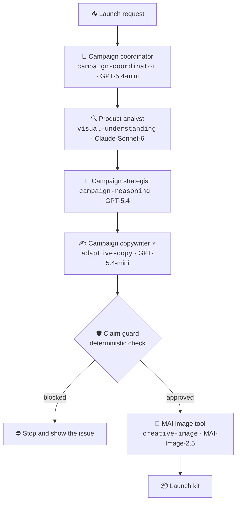
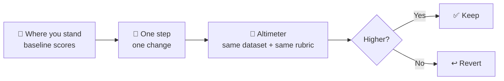

# 02 · Orientation — the studio and the hill

⏱️ **Time:** 5 minutes (read this while provisioning finishes)

## 🎯 Goal

Understand what you are building, who does what inside it, and the three rules that make the rest of the workshop a real experiment rather than a demo.

## Objectives

- Describe the Product Launch Studio scenario and its hard constraint.
- Map each of the four roles plus the image tool to a model deployment.
- State the hill-climbing rules you will follow in Lab 2.
- Locate the grounded evidence and the fixed evaluation assets.

## ✅ Prerequisites

- Module 01 started (provisioning may still be running).
- A terminal at `$WORKSHOP_SRC`.

<br/>

## 🔢 Steps

### Step 1 — Read the brief you are grounded in

```bash
cd "$WORKSHOP_SRC"
head -40 data/campaign-brief.md
ls assets/
```

This brief is the **entire universe of approved campaign claims** for the
**HikeMate TrailLite Daypack**. Its product record, manual, and photograph come
from the MIT-licensed `Azure-Samples/contoso-web` sample; exact provenance is in
`assets/PROVENANCE.md`. Five approved evidence lines — **E1 through E5** —
cover identity/use/catalog price, dimensions/weight, carrying features,
qualified water resistance, and hydration compatibility/reflective accents.
The claim rules are explicit: no fully waterproof claim, numeric capacity,
recycled/carbon-neutral claim, lifetime durability, independent certification,
or market superiority.

If a claim is not in the brief, the agent may not make it — not "should avoid," may not. That single constraint is what turns a copywriting toy into something you can evaluate.

### Step 2 — Meet the studio

Four roles run in order, then the studio checks the copy and calls the image
tool. Each role is a specialist, and each specialist gets a model chosen for
its job.



| Role | Why this model | Failure it prevents |
|---|---|---|
| **Campaign coordinator** | Fast, cheap; mostly framing and assembly | Burning a frontier model on clerical work |
| **Product analyst** | Strong long-context reading and vision over the evidence ledger and product imagery | Facts invented because nobody read the source |
| **Campaign strategist** | Strongest reasoning; audience, channel, and risk judgement | A plan that cannot be defended |
| **Campaign copywriter** ⭐ | Volume work, quality-sensitive — the interesting trade-off | Copy that is bland, or copy that is expensive |
| **MAI image tool** | Purpose-built image generation, called as a tool | Text models pretending to make images |

Two details matter more than they look:

- The orchestration passes the **original, immutable evidence ledger** to every handoff. No role is trusted to copy evidence forward correctly.
- A **deterministic claim guard** — plain code, not a model — checks every copy item before release. Models propose; code enforces.

⭐ **The copywriter is the only thing you will change in Lab 2.** Everything else stays fixed so the experiment stays clean.

### Step 3 — Learn the hill

**AgentOps** is the routine around a working agent: observe what happened,
evaluate the results, improve one target, and compare versions. In this
workshop, we use hill climbing to make that routine controlled and repeatable.

You cannot see the summit. You can only measure your **altitude** and take a
**step**.



| Rule | In plain terms | What breaks if you ignore it |
|---|---|---|
| **Measure first** | Run the baseline evaluation before touching anything | "Better" becomes a vibe |
| **One step at a time** | Change the model *or* the instructions, never both | You cannot attribute the result |
| **Never move the mountain** | The dataset and rubric are frozen for the whole workshop | Every earlier score becomes meaningless |

Your altimeter is two files. Look at them now so you trust them later:

```bash
cd "$WORKSHOP_SRC"
wc -l data/eval-cases.jsonl data/router-complexity-cases.jsonl
head -1 data/eval-cases.jsonl
cat data/evaluators/campaign-quality.yaml
```

- `data/eval-cases.jsonl` — the launch tasks, each with a `query` and an `expected_behavior` rubric.
- `data/router-complexity-cases.jsonl` — deliberately mixed easy/hard cases, used in Module 08 to see whether request complexity changes anything.
- `data/evaluators/campaign-quality.yaml` — the judge, which scores grounding and **penalises unsupported claims**.

### Step 4 — Preview your three steps

| Module | Step you take | What stays frozen |
|---|---|---|
| 03 | Choose models per role, by hand, in the playground | — |
| 08 | Remap the `adaptive-copy` **deployment** to Model Router | Agent code, deployment name, dataset, rubric |
| 09 | Let Agent Optimizer rewrite **copywriter instructions** | Model, dataset, rubric |

Notice what Module 08 does *not* require: no code edit, no new agent version, no env-var change. The deployment name `adaptive-copy` stays exactly the same; only the model behind it changes. That is the whole point of naming deployments after **jobs** instead of after models.

<br/>

## 📤 Expected result

You can answer these three questions without looking:

1. What may the copywriter say about rain protection? *Only E4's qualified
   wording: water-resistant for light rain and splashes, not waterproof; do not
   submerge it or expose it to heavy rain without cover or protection.*
2. Which deployment changes in Lab 2, and which stay fixed? *`adaptive-copy` changes; the other four are fixed.*
3. What would invalidate your Module 07 baseline? *Editing the dataset or the rubric.*

## 🏆 Quick win

```bash
cd "$WORKSHOP_SRC"
python3 -c "import json;[print('•', json.loads(l)['expected_behavior'][:110]) for l in open('data/eval-cases.jsonl') if l.strip()]"
```

In five seconds you have read the standard your agent will be held to. Most teams never write this down — and then argue about quality for months.

## 🧭 Checkpoint and recovery

**The one thing that must be true:** you can name the model behind each of the four roles, and you know which one is the optimization target.

| If… | Do this |
|---|---|
| `data/` files are missing | Run `"$WORKSHOP_SRC/scripts/preflight.sh" --env-file "$WORKSHOP_ROOT/.env"` — it validates every required asset and names what is absent. |
| Module 01 provisioning is still running | Carry on to Module 03's reading and start its playground steps as soon as `azd env get-values` shows the endpoint. |
| The brief seems too short | That is deliberate. A small, closed evidence set makes unsupported claims obvious and evaluation cheap. |

## 🔧 Troubleshooting

| Symptom | Cause | Fix |
|---|---|---|
| `data/campaign-brief.md: No such file` | `WORKSHOP_ROOT` is unset or wrong | `echo "$WORKSHOP_ROOT"` — it must end in `foundry/agent-optimization`. |
| The mermaid diagrams render as raw text | Your viewer does not support Mermaid | Read them on GitHub, or read the role table instead — it carries the same information. |
| You cannot find the roles in code | Agent source lives outside this folder | `ls "$WORKSHOP_SRC/agents/product-launch-studio"` — you will open it in Module 04. |

## ➡️ Next

You know the terrain and the rules. Time to see how differently models behave on the same task.

**[Module 03 — Model playground: pick the right tool](../lab-1-model-explore/03-model-playground.md)** · ⬆️ [Lab 0](./README.md)
