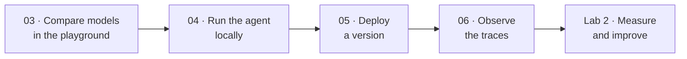

# Lab 1 — Explore models · 48 minutes

**Learn the terrain.** Before you optimize anything, you need to know what each model is good at, see the agent work, and be able to watch what it actually did.

## Modules

| # | Module | Time | Goal |
|---|---|---|---|
| 03 | [Model playground: pick the right tool](./03-model-playground.md) | 18 min | Compare four models on the same launch tasks and justify each role assignment |
| 04 | [Run the agent locally](./04-run-agent-locally.md) | 12 min | Run Product Launch Studio on localhost and watch the roles cooperate |
| 05 | [Deploy and version the agent](./05-deploy-and-version.md) | 10 min | Create an immutable agent version in Foundry and smoke-test it |
| 06 | [Observe what the agent actually did](./06-observe-the-agent.md) | 8 min | Read traces to see role-by-role behaviour, latency, and model usage |

## The thread through this lab

Model choice is your **first** and cheapest optimization lever. By the end of this lab you will have used it deliberately, and you will have the observability you need to prove the next two levers worked.

## What "done" looks like

- You can name the model behind each of the four roles and say why.
- `azd ai agent invoke` returns a grounded launch kit from the deployed agent.
- You have opened at least one trace and identified which role produced which span.

➡️ Start with [Module 03](./03-model-playground.md) · ⬆️ [Self-guided index](../README.md) · 🏠 [Workshop overview](../../../README.md)
