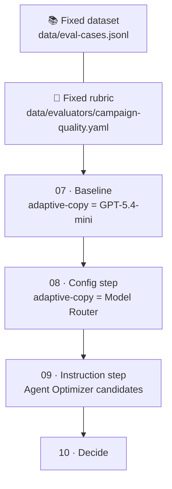

# Lab 2 — Optimize the agent · 27 minutes

**Climb the hill.** Three steps, one measuring stick. You take a baseline, change exactly one thing twice, and decide what to keep.

## Modules

| # | Module | Time | Goal |
|---|---|---|---|
| 07 | [Baseline evaluation](./07-baseline-evaluation.md) | 12 min | Record your altitude: scores for the fixed `adaptive-copy` baseline |
| 08 | [Swap in Model Router](./08-model-router-swap.md) | 5 min | Remap the same deployment name to Model Router and compare |
| 09 | [Agent Optimizer](./09-agent-optimizer.md) | 5 min | Let the optimizer propose better copywriter instructions — and review them |
| 10 | [Wrap-up and next steps](./10-wrap-up.md) | 5 min | Make a promote/revert call and clean up |

## The controlled experiment

Two things stay frozen for the whole lab: the **dataset** and the **rubric**. Two things move, one at a time: the **model behind `adaptive-copy`**, then the **copywriter instructions**. That is the entire experimental design.

## Ground rules

- **Same mountain.** If you edit `data/eval-cases.jsonl` or the rubric mid-lab, every earlier score becomes meaningless. Don't.
- **Routing is a hypothesis.** Model Router picks a model per request. It may help, hurt, or do nothing for this workload. Your job is to find out, not to assume.
- **No auto-apply.** Agent Optimizer proposes; you read the diff and decide. Nothing reaches a deployment without your review.
- **Preview software.** Model Router and Agent Optimizer are in preview. If a flag differs from these notes, trust `--help`.

➡️ Start with [Module 07](./07-baseline-evaluation.md) · ⬆️ [Self-guided index](../README.md) · 🏠 [Workshop overview](../../../README.md)
