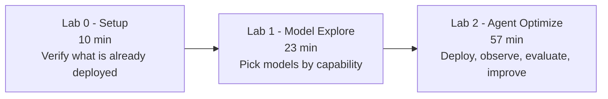
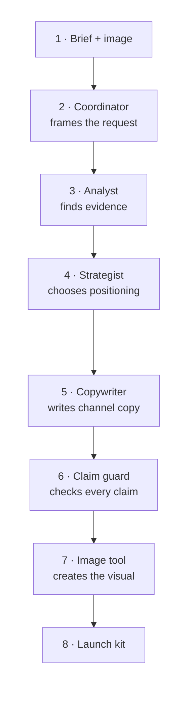

# Skillable Instruction Track — From Model Selection to Agent Optimization

Import-ready Skillable Markdown for the 90-minute **Product Launch Studio** workshop.

This track mirrors the self-guided journey in [`../self-guided/`](../self-guided/) one module at a
time, but it targets a **pre-provisioned Skillable Windows 11 lab**. Learners never provision Azure
resources here: every Microsoft Foundry project, model deployment, and agent version they need
already exists when the lab starts.

---

## 1. Delivery environment

| Item | Value |
|---|---|
| Lab client | Skillable, Markdown instructions, external instruction source (GitHub) |
| Virtual machine | Windows 11, referenced as `@lab.VirtualMachine(Windows11)` |
| Shell | Windows PowerShell / PowerShell 7 inside VS Code |
| Editor | Visual Studio Code, pinned to the desktop and taskbar |
| Workshop root on the VM | `C:\LabFiles\model-mastery\foundry\agent-optimization` |
| Azure sign-in | `@lab.CloudPortalCredential(User1)` (username + access token) |
| Provisioning by learner | **No new resources.** Module 2 · 04 applies one reviewed in-place model remap. |

> The self-guided track uses Linux (GitHub Codespaces / Dev Containers) and Bash. This track uses
> Windows and PowerShell. The learner-facing concepts, order, and timings are identical.

---

## 2. Import order

Import each file below as one Skillable instruction page, in this exact order. File names are
stable; treat them as the contract between this repository and the Skillable lab profile.

| # | Import as page | Source file | Minutes |
|--:|---|---|--:|
| 1 | Welcome | [`lab-0-setup/00-welcome.md`](lab-0-setup/00-welcome.md) | 2 |
| 2 | Sign in and open the project | [`lab-0-setup/01-sign-in-and-open-project.md`](lab-0-setup/01-sign-in-and-open-project.md) | 3 |
| 3 | Verify the pre-deployed environment | [`lab-0-setup/02-verify-predeployed-environment.md`](lab-0-setup/02-verify-predeployed-environment.md) | 5 |
| 4 | Hill-climbing orientation | [`lab-1-model-explore/00-hill-climbing-orientation.md`](lab-1-model-explore/00-hill-climbing-orientation.md) | 5 |
| 5 | Model selection in the playground | [`lab-1-model-explore/01-model-playground.md`](lab-1-model-explore/01-model-playground.md) | 18 |
| 6 | Run the multi-agent app locally | [`lab-2-agent-optimize/00-run-agent-locally.md`](lab-2-agent-optimize/00-run-agent-locally.md) | 12 |
| 7 | Change and deploy a new version | [`lab-2-agent-optimize/01-change-and-deploy.md`](lab-2-agent-optimize/01-change-and-deploy.md) | 10 |
| 8 | Inspect traces and metrics | [`lab-2-agent-optimize/02-observe-traces.md`](lab-2-agent-optimize/02-observe-traces.md) | 8 |
| 9 | Run a batch evaluation | [`lab-2-agent-optimize/03-batch-evaluation.md`](lab-2-agent-optimize/03-batch-evaluation.md) | 12 |
| 10 | Improve selection with Model Router | [`lab-2-agent-optimize/04-model-router.md`](lab-2-agent-optimize/04-model-router.md) | 5 |
| 11 | Improve instructions with Agent Optimizer | [`lab-2-agent-optimize/05-agent-optimizer.md`](lab-2-agent-optimize/05-agent-optimizer.md) | 5 |
| 12 | Compare results and wrap up | [`lab-2-agent-optimize/06-compare-and-wrap-up.md`](lab-2-agent-optimize/06-compare-and-wrap-up.md) | 5 |
| | **Total** | | **90** |

Lab 0 is **10 minutes**, Lab 1 is **23 minutes**, Lab 2 is **57 minutes**.



---

## 3. Scenario and architecture

**Product Launch Studio** turns a product photo and a campaign brief into a launch package: grounded
product evidence, a positioning strategy, channel copy, and a promotional image.
The workshop product is the **HikeMate TrailLite Daypack**, using the exact
MIT-licensed photograph, product record, and manual attributed in
`src\assets\PROVENANCE.md`.



The studio works like a relay team: each specialist adds one piece and passes
the same evidence forward. Follow steps 1–4 across the top, then 5–8 back across
the bottom. Foundry captures traces across the run so learners can measure and
improve the copywriter without changing the rest of the team.

| Role | Deployment learners see | Underlying model |
|---|---|---|
| Campaign Coordinator | `campaign-coordinator` | GPT-5.4-mini |
| Product Analyst | `visual-understanding` | Claude-Sonnet-6, GPT-5.4 fallback |
| Campaign Strategist | `campaign-reasoning` | GPT-5.4 |
| Campaign Copywriter | `adaptive-copy` | GPT-5.4-mini initially; remapped to Model Router in Lab 2 |
| Image generation tool | `creative-image` | MAI-Image-2.5 |

Instructions always name the **purpose-based deployment**, never the underlying model, so the lab
survives a model swap.

---

## 4. Environment contract (what the lab image must provide)

The lab profile owner must guarantee all of the following **before** a learner starts. Every module
in this track assumes it, and Lab 0 verifies it.

**On the Windows 11 VM**

1. `C:\LabFiles\model-mastery\foundry\agent-optimization` is the workshop root. Its `src\`
   directory is the azd project root and contains `azure.yaml`, `agents\product-launch-studio\`,
   `assets\`, `data\`, `scripts\`, and `checkpoints\`. Specifically:
   `src\assets\traillite-daypack.png`, `src\assets\PROVENANCE.md`,
   `src\assets\contoso-web-MIT-LICENSE.md`, `src\data\campaign-brief.md`,
   `src\data\eval-cases.jsonl`, and `src\data\evaluators\campaign-quality.yaml`.
2. Visual Studio Code with the Python and Jupyter extensions, trusted workspace already accepted.
3. Python 3.13, project dependencies pre-installed into `.venv`.
4. Azure CLI, Azure Developer CLI `azd` 1.20 or later, and the `azure.ai.agents` azd extension.
5. An azd environment named `workshop` already selected, with
   `src\.azure\workshop\.env` populated. The parent workshop root contains `.env`, copied from
   `sample.env` and completed by the instructor.

**In the Microsoft Foundry project**

6. Exactly five model deployments — `campaign-coordinator`, `visual-understanding`,
   `campaign-reasoning`, `adaptive-copy`, and `creative-image` — all healthy with quota.
7. A deployed, running hosted agent version of `product-launch-studio` (the baseline).
8. Application Insights connected to the project so traces appear in the portal.
9. An evaluation dataset and rubric registered for the copywriting suite.
10. An optimizer-eligible model deployment, surfaced to learners as the azd environment value
    `OPTIMIZER_MODEL_DEPLOYMENT`, used by `azd ai agent optimize --optimize-model`.
11. Learner RBAC that allows read, invoke, deploy, evaluate, and optimize — **not** resource creation.

**Scripts on the VM**

12. `src\scripts\preflight.ps1` — read-only environment report; use `-EnvFile ..\.env`, with
    `-Online` for Azure catalog and quota checks.
13. `src\scripts\switch-router.ps1` — remaps the existing `adaptive-copy` deployment from its fixed
    GPT-5.4-mini model to Model Router. Its interface is
    `-EnvFile PATH [-Offline|-Apply] [-Yes]`: the default is an Azure what-if preview, `-Offline`
    prints a local preview, and `-Apply` provisions the reviewed remap.

**Prepared fallbacks committed in the repository**

14. `src\checkpoints\00-baseline\` and `src\checkpoints\01-evidence-optimized\` — reviewable,
    instructor-authored instruction checkpoints. Their metadata explicitly says they are not measured
    service output.
15. `src\checkpoints\optimizer-result.sample.json` — an offline optimizer-result shape with null
    scores and no invented operation ID.
16. `src\checkpoints\evaluation\` — explicitly labelled instructor-prepared examples for baseline,
    router, optimized, trace, and optimizer-review recovery. They are teaching examples, not live
    measurements; learner-local `eval show` output belongs under `src\.foundry\results\`.

> If `visual-understanding` cannot be backed by Claude-Sonnet-6 in the delivery region, remap it to
> GPT-5.4. No learner instruction changes.

---

## 5. Authoring conventions used in this track

Keep these consistent when you edit or extend the track.

| Convention | Usage |
|---|---|
| `1. []` | Task checkbox. Every action a learner performs is a checkbox so Skillable can report progress. |
| `+++text+++` | TypeText. One-click typing into the VM. Used for credentials and short single-line commands. |
| `@lab.VirtualMachine(Windows11).Username` / `.Password` | VM credential replacement tokens. |
| `@lab.CloudPortalCredential(User1).Username` / `.AccessToken` | Azure sign-in replacement tokens. |
| `>[!Knowledge]` | Concept explanation. Why this step matters. |
| `>[!Hint]` | Recovery path when the expected state is missing. |
| `>[!Alert]` | Hard constraint or something that can break the lab. |
| `>[!tip]` | Optional convenience or shortcut. |
| `>[!note]` | Short aside or reminder. |
| ` ```powershell ` | Multi-line copyable commands. |
| `<!-- SCREENSHOT: ... -->` | Placeholder marking exactly where a screenshot belongs. See below. |

**Deliberately not used:** dialog links, dropdowns, text-input variables, collapsible sections,
activities, and page breaks (`===`). One file equals one page. Skillable custom syntax is powerful,
but a beginner workshop reads better without clutter.

**Screenshots.** No binary screenshots are committed. Each module carries
`<!-- SCREENSHOT: ../images/<file>.png -->` HTML comments, which render as nothing, at the exact
insertion point. [`images/README.md`](images/README.md) is the capture manifest: file name, what to
capture, and the alt text to use. After capture, replace each comment with
``.

**PowerShell and azd.** Every Foundry-facing azd operation — `azd ai ...` and `azd deploy` — sets
the Foundry user agent inline immediately before the command and removes it immediately after, so
the setting never persists into the shell, the azd environment, `.env`, or `azure.yaml`:

```powershell
Set-Location 'C:\LabFiles\model-mastery\foundry\agent-optimization\src'
$env:AZURE_DEV_USER_AGENT = 'microsoft_foundry_skill'
azd ai agent show --output json
Remove-Item Env:\AZURE_DEV_USER_AGENT
```

Plain local commands — `azd auth login`, `azd env list`, `azd env select`, `azd env set`,
`azd env get-value(s)` — are shown without the wrapper, because adding it there is noise for a
beginner audience and carries no telemetry value.

>[!Alert] Learners never run bare `azd provision`. The only provisioning operation is encapsulated
by `switch-router.ps1 -EnvFile ..\.env -Apply`, which remaps the existing `adaptive-copy`
deployment after its default preview. Modules 2 · 01 and 2 · 04 call this out explicitly.

---

## 6. Guardrails baked into every module

1. **Learners never create an additional Azure resource.** No bare `azd provision`, no
   `az ... create`, and no portal deployment wizard. The reviewed router script only remaps the
   existing `adaptive-copy` deployment.
2. **Optimizer candidates are never auto-applied.** `azd ai agent optimize apply` is always preceded
   by an explicit review step, and `azd ai agent optimize deploy` is never used.
3. **Every module is complete.** Time, goal, objectives, prerequisites, numbered steps, expected
   result, quick win, checkpoint and recovery, troubleshooting, and a transition.
4. **Every module has a recovery path** that uses a committed checkpoint, so a single failure never
   ends a learner's workshop.
5. **No secrets, endpoints, or subscription IDs** appear in instructions. Values come from the azd
   environment or Skillable replacement tokens.

---

## 7. Instructor pre-delivery checklist

Run through this the day before delivery.

1. [] Confirm exact model identifiers, versions, and regional availability for every deployment in
   section 4.
2. [] Confirm `visual-understanding` accepts image input, or remap it to GPT-5.4.
3. [] Confirm Model Router eligibility and the configured model subset used to remap `adaptive-copy`.
4. [] Confirm quota and capacity for a full class running concurrently.
5. [] Confirm learner RBAC allows invoke, deploy, evaluate, and optimize but not resource creation.
6. [] Confirm the baseline hosted agent version deploys and answers one smoke invocation.
7. [] Confirm traces reach Application Insights and are visible in the portal.
8. [] Confirm Agent Optimizer is available and that
   `src\checkpoints\optimizer-result.sample.json` matches the current candidate schema.
9. [] Confirm every checkpoint file in section 4 is present on the VM image.
10. [] Walk one module end to end on a freshly launched lab instance.

---

## 8. Related material

- Self-guided track: [`../self-guided/`](../self-guided/)
- Workshop root: [`../../`](../../)
- [Microsoft Foundry hosted agents](https://learn.microsoft.com/azure/ai-foundry/agents/concepts/hosted-agents?view=foundry)
- [Model Router in Microsoft Foundry](https://learn.microsoft.com/azure/ai-foundry/openai/concepts/model-router)
- [Skillable: creating lab instructions](https://docs.skillable.com/docs/creating-lab-instructions)
- [Skillable: Markdown syntax](https://docs.skillable.com/docs/creating-instructions-with-markdown-syntax)
