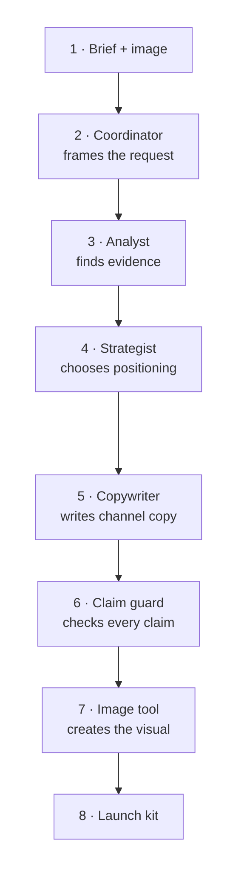

# Welcome to **From Model Selection to Agent Optimization with Microsoft Foundry**

**Time:** 2 minutes

Building reliable AI agents takes more than a good prompt. It takes **observability** and
**continuous optimization**. Over the next 90 minutes you will climb one hill: start from a working
multi-agent application, measure it, and improve it twice with evidence.

## Goal

Understand the scenario, the three labs, and the one loop that connects them, so every later step
has a place to land.

## Learning objectives

By the end of this page you can:

- Describe the Product Launch Studio scenario in one sentence.
- Name the three labs and what each one produces.
- Explain what "hill climbing" means for an AI agent.

## Prerequisites

- None. This is the first page of the lab.

## The scenario: Product Launch Studio

The workshop supplies the MIT-licensed **HikeMate TrailLite Daypack** photo and
an evidence ledger derived from its product record and manual. Your application
has to produce a launch package: what is visibly observable, who the product is
for, channel copy, and a promotional image — without confusing visual
observations with manual-backed claims.

Four AI roles collaborate, plus one image tool:



Think of this as a relay team: each specialist adds one piece and passes the
same evidence forward. Follow steps 1–4 across the top, then 5–8 back across the
bottom.

>[!Knowledge] A **model** is the AI itself. A **model deployment** is a named, callable instance of
that model in your Microsoft Foundry project. An **agent** is a program that uses a model to decide
what to do and which tools to call. A **tool** is a function the agent can call. This workshop keeps
those four words distinct on purpose — most agent bugs are really deployment or tool bugs.

## What you will do

1. [] Read the three-lab map below.

    | Lab | Time | You will produce |
    |---|--:|---|
    | **Lab 0 — Setup** | 10 min | A verified, ready environment |
    | **Lab 1 — Model Explore** | 23 min | A capability-to-task selection table |
    | **Lab 2 — Agent Optimize** | 57 min | A measured before-and-after scorecard |

1. [] Read the loop you will run in Lab 2.

    The full route from baseline to target is our **hill climb**. At every step,
    we repeat an **AgentOps** workflow: run, observe, evaluate, improve, and
    compare.

    ```mermaid
    flowchart LR
        B["Baseline<br/>fixed model"] --> O["Observe<br/>traces"]
        O --> E["Evaluate<br/>rubric scores"]
        E --> I["Improve<br/>one lever"]
        I --> M["Measure again<br/>same dataset"]
        M --> B
    ```

1. [] Note the two levers you will pull, one at a time:

    - **Model Router** — change *which model* answers, leaving instructions alone.
    - **Agent Optimizer** — change *the instructions*, leaving model selection alone.

>[!Knowledge] **Hill climbing** means changing exactly one thing, measuring against the same
dataset and the same rubric, and keeping the change only if the score improves. Changing two things
at once feels faster and teaches you nothing, because you cannot attribute the result.

>[!Alert] This lab environment is **already provisioned**. The Microsoft Foundry project, every
model deployment, and a running baseline agent all exist. You will never create Azure resources in
this workshop. If an instruction ever seems to ask you to provision something, stop and re-read —
it does not.

## Expected result

You can answer, without looking back: *what does Product Launch Studio produce, and what does hill
climbing require?*

## Quick win

You already know the shape of the whole workshop — a baseline, two levers, and one scorecard — in
under two minutes.

## Checkpoint and recovery

Nothing to recover yet. If the lab client has not finished starting the virtual machine, wait for
the desktop to appear before continuing.

## Troubleshooting

| Symptom | Fix |
|---|---|
| The lab client shows a black screen or a spinner | The VM is still booting. Wait up to two minutes. |
| Diagrams above render as plain code | Your lab client has Mermaid rendering disabled. The tables and lists carry the same information; keep going. |

## Next

Sign in to the virtual machine and open the workshop project in Visual Studio Code.
