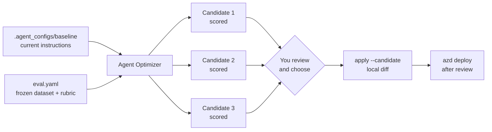

# Lab 2 · Module 05 — Improve instructions with Agent Optimizer

**Time:** 5 minutes

## Goal

Start an Agent Optimizer run against the Campaign Copywriter, review the scored candidates it
proposes, and deliberately choose one — without ever letting the tool apply a change on its own.

## Learning objectives

By the end of this module you can:

- Start an Agent Optimizer run from an azd project.
- Explain how candidates are generated and scored.
- Compare candidates against the baseline configuration.
- Apply a chosen candidate locally and review the diff before deploying.

## Prerequisites

- [Lab 2, module 04](./04-model-router.md) complete:
  `COPYWRITER_DEPLOYMENT_MODE` is `routed`, and `adaptive-copy` points to Model
  Router.
- [Lab 2, module 03](./03-batch-evaluation.md) complete: `eval.yaml` is
  confirmed, and the dataset and rubric are fixed.

>[!Alert] **Never auto-apply a candidate.** In this module you inspect candidates first, then apply
one explicitly with `azd ai agent optimize apply --candidate`, then read the diff, and only then
deploy. Do not use `azd ai agent optimize deploy` — it collapses those review steps into one.

## Instructions

### Step 1 — Confirm the optimization target (30 seconds)

1. [] Confirm the baseline configuration Agent Optimizer compares against exists:

    ```powershell
    Set-Location 'C:\LabFiles\model-mastery\foundry\agent-optimization\src'
    Get-ChildItem .\agents\product-launch-studio\.agent_configs\baseline -Recurse -File |
      Select-Object -ExpandProperty Name
    ```

    **Expected result:** the baseline metadata and the current copywriter instruction text.

1. [] Ensure the baseline metadata names the real purpose-based deployment rather than its shipped
   placeholder:

    ```powershell
    $metadata = '.\agents\product-launch-studio\.agent_configs\baseline\metadata.yaml'
    (Get-Content $metadata) -replace '^model: copywriter-fixed$', 'model: adaptive-copy' |
      Set-Content $metadata
    Select-String -Path $metadata -Pattern '^model:'
    ```

    **Expected result:** `model: adaptive-copy`.

### Step 2 — See what Agent Optimizer will do (30 seconds)

1. [] Confirm the only thing we are changing is the **Campaign Copywriter
   instructions**.



>[!Knowledge] Agent Optimizer proposes instruction variants and scores them
against the **same dataset and rubric** in `eval.yaml`. It automates the search
inside one AgentOps step; we still decide whether that step advances our hill
climb.

### Step 3 — Start the optimization run (1 minute)

1. [] Start the run from the `src` azd project root, naming an optimizer-eligible deployment:

    ```powershell
    $env:AZURE_DEV_USER_AGENT = 'microsoft_foundry_skill'
    azd ai agent optimize --optimize-model $(azd env get-value OPTIMIZER_MODEL_DEPLOYMENT)
    Remove-Item Env:\AZURE_DEV_USER_AGENT
    ```

    **Expected result:** azd submits the job and prints an operation ID and a portal URL. Record the
    operation ID.

<!-- SCREENSHOT: ../images/lab2-optimize-submitted.png -->

1. [] Check its progress once:

    ```powershell
    $env:AZURE_DEV_USER_AGENT = 'microsoft_foundry_skill'
    azd ai agent optimize status <operation-id>
    Remove-Item Env:\AZURE_DEV_USER_AGENT
    ```

	>[!Alert] **An optimizer run usually takes longer than this module.** That is expected and
    planned for. Leave the run going and continue with Step 4 using the prepared example. Add
    `--watch` only if your class is running ahead of schedule.

### Step 4 — Review the instructor-prepared example (2 minutes)

1. [] Open the prepared optimizer-result shape and review guide:

    ```powershell
    Get-Content .\checkpoints\optimizer-result.sample.json
    Get-Content .\checkpoints\evaluation\optimizer-review.example.md
    ```

    **Expected result:** the JSON explicitly has null scores and no remote operation ID; the review
    guide contains clearly labelled illustrative values and points to the two real instruction
    checkpoints.

<!-- SCREENSHOT: ../images/lab2-optimizer-candidates.png -->

1. [] Compare `checkpoints\00-baseline\instructions.md` with
   `checkpoints\01-evidence-optimized\instructions.md`, and note three things:

    | Question | Where to look |
    |---|---|
    | What did it change in the instructions? | The candidate's instruction diff |
    | Which rubric criteria improved? | Per-criterion scores |
    | Did any criterion get **worse**? | Per-criterion scores |

1. [] Write one sentence explaining whether the prepared candidate is safer or clearer than the
   baseline, referring to the example rubric criteria rather than wording alone.

	>[!tip] The highest overall score is not automatically the right choice. A candidate that gains a
    point on usefulness while losing evidence fidelity is a bad trade in this scenario, because
    grounding is the constraint the whole business case rests on.

>[!Knowledge] Agent Optimizer is a search tool, not a decision maker. If our
rubric gives too little weight to something important, the top candidate may
improve the wrong behavior. We own the rubric and the final decision.

### Step 5 — Apply a candidate locally and review the diff (1 minute)

1. [] If your live run has completed, apply a candidate from **your live operation** — this writes
   local files only:

    ```powershell
    $env:AZURE_DEV_USER_AGENT = 'microsoft_foundry_skill'
    azd ai agent optimize apply --candidate <candidate-id>
    Remove-Item Env:\AZURE_DEV_USER_AGENT
    ```

    **Expected result:** azd reports which local files it changed. Nothing is deployed. Never use the
    prepared identifier as a live candidate ID.

1. [] Open `agents\product-launch-studio\.agent_configs\baseline\instructions.md` in VS Code and
   read the new instructions. Confirm they still forbid unsupported claims.

	>[!Alert] If the applied instructions weaken the grounding or no-unsupported-claims rules, **do
    not deploy them**. Reject the candidate and pick another. A higher aggregate score never
    justifies losing a safety constraint.

1. [] If you applied a live candidate, deploy it only after reading the change:

    ```powershell
    $env:AZURE_DEV_USER_AGENT = 'microsoft_foundry_skill'
    azd deploy product-launch-studio
    Remove-Item Env:\AZURE_DEV_USER_AGENT
    ```

    **Expected result:** a new agent version. Record it as **v-optimized**.

## Expected result

An optimizer run is in flight or complete. You reviewed a live candidate when available, otherwise
you reviewed the explicitly labelled instructor-prepared example. A live applied candidate was read
before deployment as **v-optimized**.

## Quick win

You identified the best candidate and can explain in rubric terms why it beat the baseline — the
skill that separates using an optimizer from trusting one.

## Checkpoint and recovery

```powershell
Set-Location 'C:\LabFiles\model-mastery\foundry\agent-optimization\src'
$env:AZURE_DEV_USER_AGENT = 'microsoft_foundry_skill'
azd ai agent optimize list
azd ai agent show --output json
Remove-Item Env:\AZURE_DEV_USER_AGENT
```

**Expected result:** your run appears in the list. If you applied a live candidate, the agent also
reports the new **v-optimized** version.

>[!Hint] **Recovery.** If your live run fails or cannot be applied in time, review the real prepared
checkpoints without presenting them as service output:
```powershell
Set-Location 'C:\LabFiles\model-mastery\foundry\agent-optimization\src'
Get-Content .\checkpoints\00-baseline\instructions.md
Get-Content .\checkpoints\01-evidence-optimized\instructions.md
Get-Content .\checkpoints\optimizer-result.sample.json
```
Record this as a **prepared example review**, not a deployed optimized version. To cancel a
still-running job from `src`: `azd ai agent optimize cancel <operation-id>`.

## Troubleshooting

| Symptom | Fix |
|---|---|
| `OPTIMIZER_MODEL_DEPLOYMENT` is empty | Run `azd env get-values` and use the optimizer deployment name it lists. If none is present, tell your instructor. |
| The optimizer rejects the model | Only specific models are eligible as optimizer models. Use the deployment your instructor provisioned for this purpose. |
| The run stays queued | Expected under class load. Continue with the prepared example review; check back in [module 06](./06-compare-and-wrap-up.md). |
| `apply` reports no changes | Use only a candidate ID printed for your live operation. Prepared checkpoint identifiers are never valid live candidate IDs. |
| The diff is larger than expected | Read all of it before deploying. If it touches a role other than the copywriter, reject it — this lab optimizes one surface only. |
| Deployment after apply fails | Do not substitute the prepared example as a live result. Keep the routed configuration, record the failure, and use the [module 06](./06-compare-and-wrap-up.md) example only to practise comparison. |

## Transition

You have measured fixed and routed versions, plus either a live optimized version or a clearly
labelled prepared example. Time to compare them without confusing illustrative data with live data.
