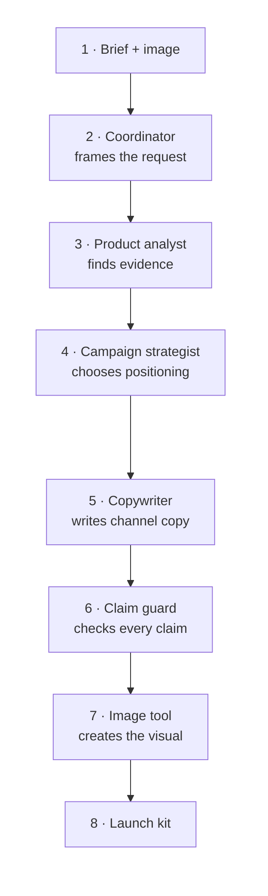

# Architecture and model roles

The roles run in this order and carry the original evidence through every
handoff. Foundry captures traces for the full run; Application Insights and Log
Analytics make those traces available for observation and evaluation.

| Stable deployment | Initial catalog intent | Purpose |
| --- | --- | --- |
| `campaign-coordinator` | GPT-5.4-mini | Fast intent classification and orchestration |
| `visual-understanding` | Claude Sonnet 6 preferred | Image description and visual reasoning |
| `campaign-reasoning` | GPT-5.4 | Claim reconciliation and complex campaign plans |
| `adaptive-copy` | GPT-5.4-mini, later Model Router | Demonstrates stable endpoint with adaptive model choice |
| `creative-image` | MAI-Image-2.5 | New synthetic campaign imagery |

## Why aliases matter

Agent code receives purpose-based deployment names, not model catalog versions.
Infrastructure can therefore remap `adaptive-copy` without changing agent code.
Model Router chooses among supported underlying models based on request
complexity. It does not remove the need for evaluation, budgets, rate-limit
handling, or explicit routing where a particular modality is required.

## Visual fallback

Claude Sonnet 6 is preferred only when the live regional catalog, SKU, quota,
Marketplace eligibility, and endpoint protocol are verified. If any check
fails, set the `VISUAL_UNDERSTANDING_*` values to the GPT-5.4 fallback values
from the same verified catalog. The deployment alias remains unchanged.

## Hosted-agent mode

This project uses direct code deployment, Basic Agent Setup, and Responses
protocol. No ACR is needed. `ENABLE_CAPABILITY_HOST=false` is intentional;
turn it on only for a reviewed Standard Agent Setup with bring-your-own
conversation storage.

## Identity and telemetry

Local setup uses Azure CLI credentials. Azure resources use managed identity,
local authentication is disabled on the Foundry account, and the participant is
assigned Azure AI User at project scope. Application Insights is workspace
based and connected to the project. Do not log prompts or images containing
personal, confidential, or regulated data.

References:

- [Foundry models](https://learn.microsoft.com/azure/foundry/foundry-models/concepts/models)
- [Model Router](https://learn.microsoft.com/azure/foundry/openai/concepts/model-router)
- [Hosted agents](https://learn.microsoft.com/azure/ai-foundry/agents/concepts/hosted-agents)
- [Agent observability](https://learn.microsoft.com/azure/ai-foundry/agents/concepts/tracing)
- [Azure authentication](https://learn.microsoft.com/azure/developer/python/sdk/authentication-overview)
