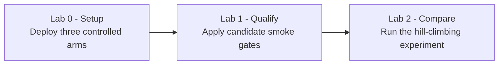

# Microsoft Foundry Model Router Optimisation Workshop

A hands-on workshop for deploying, measuring, and comparing Microsoft Foundry Model Router configurations with live, privacy-safe evidence.

You will practice a **deploy -> measure -> compare -> iterate** loop. The goal is not only to call a router endpoint. The goal is to make model-selection decisions that are reproducible, inspectable, and constrained by quality and safety.

## 1. The story

Northstar Devices has launched its Aurora X1 phone into a carrier disruption, duplicate-payment incident, and phishing campaign. You own the model-selection policy for its overloaded support assistant. Your goal is to determine whether Model Router can **lower inference cost and latency without reducing policy compliance or account-security quality**. A fixed model is the baseline, and every candidate must retain the hard quality constraints before an efficiency improvement counts.



## 2. What you will build

| Lab | Folder | What it produces | Time |
|---|---|---|---|
| **Lab 0 - Deploy the comparison models** | [lab-0-setup](lab-0-setup/SETUP.md) | A fixed GPT baseline, a GPT-family router, an open-weight router, and a populated `.env` | About 20 min |
| **Lab 1 - Qualify one live router** | [lab-1-live-evaluation](lab-1-live-evaluation/README.md) | Twenty live core and challenge cases, candidate gates, routing evidence, and redacted artifacts | About 40 min |
| **Lab 2 - Complete the hill climb** | [lab-2-hill-climbing](lab-2-hill-climbing/README.md) | A live three-arm notebook, two controlled Auto Evaluation runs, and a promotion decision | About 60 min plus evaluation runtime |

Total guided time is about two hours. A statistically useful evaluation with 100 or more prompts takes longer.

## 3. Prerequisites

- An Azure subscription with an existing Microsoft Foundry account and project.
- Permission to create model deployments and invoke the project.
- Azure CLI authenticated to the correct tenant and subscription.
- PowerShell 7 for the Lab 0 deployment script.
- Python 3.13 and `uv` for the Lab 1 and Lab 2 notebooks.
- Regional quota for the selected fixed model and two Model Router deployments.

The deployment script does not create the Foundry account, project, RBAC assignments, or quota.

## 4. Workshop conventions

- Complete the labs in numeric order.
- Each lab opens with a scenario and tasks, includes its own setup, and closes with key takeaways.
- Notebooks are live-only. There is no mock or simulation execution path.
- Environment variables live in the repository-root [.env.example](.env.example). Lab 0 creates the ignored `.env`.
- Model names and versions are explicit so every result can be tied to a deployment manifest.
- The current Lab 1 source workload contains 20 core and challenge cases. It is a functional smoke test, not a benchmark or service-level claim.

## 5. Get started

If you are completing the workshop on your own machine, create and activate a virtual environment from the repository root before starting the labs:

```powershell
uv venv .venv --python 3.13
.\.venv\Scripts\Activate.ps1
```

```powershell
az login

.\lab-0-setup\deploy-models.ps1 `
    -SubscriptionId <subscription-id> `
    -ResourceGroup <resource-group> `
    -AccountName <foundry-account-name> `
    -ProjectEndpoint https://<account>.services.ai.azure.com/api/projects/<project>
```

Review the target displayed by the script before confirming deployment. Then continue with [Lab 1](lab-1-live-evaluation/README.md).

## Security and production notes

- Do not commit `.env`, credentials, customer prompts, raw responses, or sensitive evaluation data.
- Prefer managed identity and least-privilege Azure RBAC for deployed workloads.
- Treat quality, policy compliance, safety, privacy, and model licensing as hard constraints.
- Compare latency percentiles, errors, retries, token usage, and model distribution alongside quality.
- Validate current availability, lifecycle, quota, context limits, and pricing before every workshop delivery.

## References

- [Model Router concepts](https://learn.microsoft.com/azure/foundry/openai/concepts/model-router)
- [Use Model Router in Microsoft Foundry](https://learn.microsoft.com/azure/foundry/openai/how-to/model-router)
- [Model Router Auto Evaluation toolkit](https://github.com/microsoft-foundry/Model-Router-Auto-Evaluation)
- [DefaultAzureCredential guidance](https://learn.microsoft.com/python/api/azure-identity/azure.identity.defaultazurecredential)
